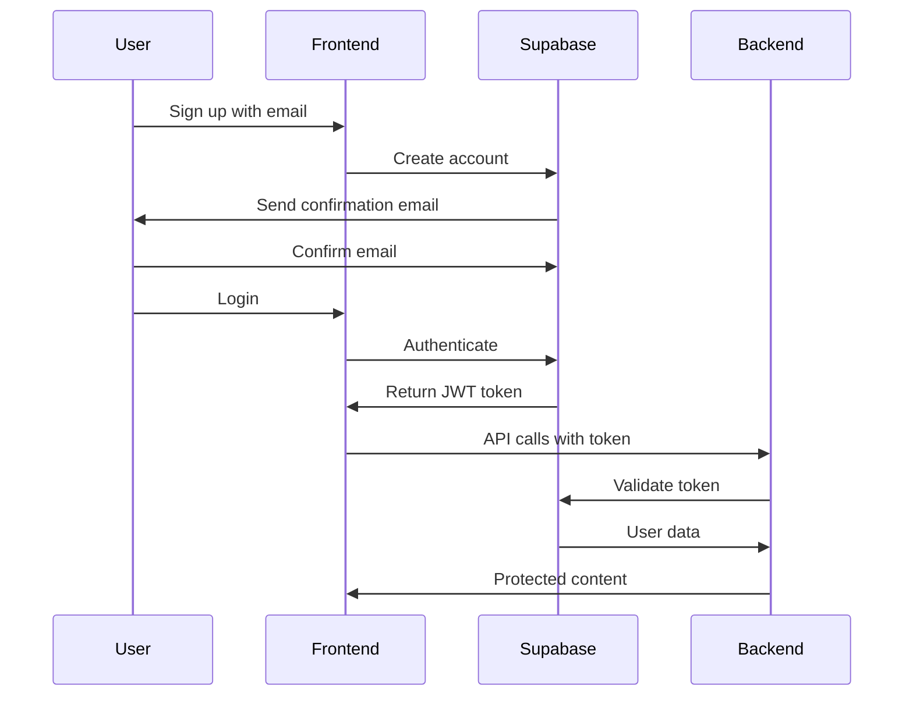

<div align="center">
  
  
  # 🎬 WeFlix
  
  **A Modern Netflix-Style Streaming Platform**
  
  [](https://reactjs.org/)
  [](https://www.typescriptlang.org/)
  [](https://vitejs.dev/)
  [](https://supabase.com/)
  [](https://tailwindcss.com/)
  [](https://expressjs.com/)
  
  A full-stack movie streaming platform with real movie data, user authentication, and modern Netflix-style UI
  
  [🚀 Live Demo](https://weflixmovie.netlify.app/) • [📖 Documentation](#-quick-start) • [🐛 Report Bug](../../issues) • [✨ Request Feature](../../issues)
</div>

---

## 📸 Screenshots

<div align="center">
  
  <p><em>WeFlix Home Page - Netflix-style interface with trending movies and TV shows</em></p>
</div>

---

## ✨ Features

### 🔐 **Authentication & User Management**
- Secure email/password authentication with Supabase
- Email confirmation and password reset
- User profiles with customizable avatars
- Protected routes and session management

### 🎥 **Content Discovery**
- **20,000+** movies and TV shows from TMDB API
- Real-time trending content
- Categories: Popular, Top Rated, Now Playing, Upcoming
- High-quality movie posters and backdrops
- Detailed movie/TV show information and trailers

### 🔍 **Advanced Search**
- Multi-search across movies and TV shows
- Real-time search suggestions
- Search history and recent searches
- Filter by genre, year, and rating

### 📚 **Personal Watchlist**
- Add/remove movies and TV shows to your list
- Persistent watchlist across devices
- Quick access to saved content
- Watchlist management and organization

### 🎨 **Modern UI/UX**
- Netflix-inspired design with smooth animations
- Fully responsive across all devices
- Dark theme with elegant color schemes
- Lazy loading and code splitting for performance
- Skeleton loading states

### 🚀 **Performance & Optimization**
- Route-based code splitting
- Image lazy loading and optimization
- API response caching
- Rate limiting and security middleware
- SEO-friendly routing

## 🛠️ Tech Stack

<table>
<tr>
<td>

**Frontend**
- ⚛️ React 18 with TypeScript
- 🚀 Vite for build tooling
- 🎨 Tailwind CSS for styling
- 🧭 React Router v7 for navigation
- 🔗 Supabase client for auth
- 🎣 Custom hooks for state management
- 🎭 Lucide React for icons

</td>
<td>

**Backend**
- 🟢 Node.js with Express.js
- 🎬 TMDB API integration
- 🗄️ Supabase for database & auth
- 🛡️ Helmet for security headers
- 🚦 Rate limiting with express-rate-limit
- 💾 In-memory caching with node-cache
- 🔒 CORS configuration

</td>
</tr>
</table>

## 📋 Prerequisites

Before you begin, ensure you have the following installed and set up:

- 🟢 **Node.js 18+** and npm
- 🗄️ **Supabase account** (free tier available)
- 🎬 **TMDB API account** (free with registration)

## 🚀 Quick Start

### 1️⃣ Clone and Install

```bash
# Clone the repository
git clone <repository-url>
cd WeFlix

# Install all dependencies
npm install && cd server && npm install && cd ..
```

### 2️⃣ Environment Setup

<details>
<summary><strong>📁 Frontend Environment (.env)</strong></summary>

Create a `.env` file in the root directory:

```env
VITE_SUPABASE_URL=your_supabase_project_url
VITE_SUPABASE_ANON_KEY=your_supabase_anon_key
VITE_API_BASE_URL=http://localhost:5000/api
```
</details>

<details>
<summary><strong>🔧 Backend Environment (server/.env)</strong></summary>

Create a `.env` file in the `server/` directory:

```env
PORT=5000
TMDB_API_KEY=your_tmdb_api_key
TMDB_BASE_URL=https://api.themoviedb.org/3
SUPABASE_URL=your_supabase_project_url
SUPABASE_SERVICE_KEY=your_supabase_service_role_key
FRONTEND_URL=http://localhost:5173
```
</details>

### 3️⃣ Get Your API Keys

<details>
<summary><strong>🎬 TMDB API Key</strong></summary>

1. Visit [TMDB](https://www.themoviedb.org/) and create an account
2. Verify your email address
3. Navigate to **Settings** → **API**
4. Request an API key (select "Developer" option)
5. Fill out the application form
6. Copy your API key to the backend `.env` file

</details>

<details>
<summary><strong>🗄️ Supabase Setup</strong></summary>

1. Go to [Supabase](https://supabase.com/) and create a new project
2. Wait for the project to be fully provisioned
3. Navigate to **Settings** → **API** to get your keys:
   - `SUPABASE_URL`: Your project URL
   - `SUPABASE_ANON_KEY`: Your anon/public key  
   - `SUPABASE_SERVICE_KEY`: Your service role key ⚠️ **Keep this secret!**

</details>

### 4️⃣ Database Setup

<details>
<summary><strong>🗃️ Run Database Schema</strong></summary>

Execute this SQL in your Supabase SQL editor:

```sql
-- Create watchlist table
CREATE TABLE watchlist (
    id UUID DEFAULT gen_random_uuid() PRIMARY KEY,
    user_id UUID REFERENCES auth.users(id) ON DELETE CASCADE,
    media_id INTEGER NOT NULL,
    media_type TEXT NOT NULL CHECK (media_type IN ('movie', 'tv')),
    title TEXT NOT NULL,
    poster_path TEXT,
    backdrop_path TEXT,
    overview TEXT,
    release_date TEXT,
    vote_average DECIMAL,
    added_at TIMESTAMP WITH TIME ZONE DEFAULT NOW(),
    UNIQUE(user_id, media_id, media_type)
);

-- Enable Row Level Security
ALTER TABLE watchlist ENABLE ROW LEVEL SECURITY;

-- Create policies for secure access
CREATE POLICY "Users can only access their own watchlist" ON watchlist
    FOR ALL USING (auth.uid() = user_id);

CREATE POLICY "Users can insert their own watchlist items" ON watchlist
    FOR INSERT WITH CHECK (auth.uid() = user_id);
```

**Enable Email Confirmation:**
1. Go to **Authentication** → **Settings** in Supabase
2. Enable "Confirm email" under Email Auth
3. Customize email templates if desired

</details>

### 5️⃣ Launch the Application

```bash
# Terminal 1: Start Backend Server
cd server && npm run dev

# Terminal 2: Start Frontend Server  
npm run dev
```

🎉 **You're all set!** 
- Frontend: `http://localhost:5173`
- Backend API: `http://localhost:5000`

## 📁 Project Structure

```
WeFlix/
├── 🎨 src/                          # Frontend source code
│   ├── 🧩 components/              # Reusable React components
│   │   ├── HeroSection.tsx         # Netflix-style hero banner
│   │   ├── LoadingSpinner.tsx      # Loading states & spinners
│   │   ├── MovieRow.tsx            # Horizontal scrolling movie rows
│   │   ├── MovieDetailsModal.tsx   # Movie/TV show details popup
│   │   ├── VideoPlayer.tsx         # Video streaming component
│   │   ├── Sidebar.tsx             # Navigation sidebar
│   │   └── ProtectedRoute.tsx      # Route protection wrapper
│   ├── 🎯 contexts/                # React context providers
│   │   ├── AuthContext.tsx         # Authentication state
│   │   └── VideoPlayerContext.tsx  # Video player state
│   ├── 🎣 hooks/                   # Custom React hooks
│   │   ├── useMovies.ts            # Movie/TV data fetching
│   │   ├── useProfile.ts           # User profile management
│   │   └── useWatchlist.ts         # Watchlist operations
│   ├── 📄 pages/                   # Page components
│   │   ├── Landing.tsx             # Landing/welcome page
│   │   ├── Home.tsx                # Main dashboard
│   │   ├── Movies.tsx              # Movies catalog
│   │   ├── TVShows.tsx             # TV shows catalog
│   │   ├── Search.tsx              # Advanced search page
│   │   ├── MyList.tsx              # Personal watchlist
│   │   ├── Settings.tsx            # User settings
│   │   ├── Login.tsx               # Authentication
│   │   └── SignUp.tsx              # User registration
│   └── 🎭 assets/                  # Static assets
├── 🔧 server/                      # Backend API
│   ├── ⚙️ config/                  # Configuration files
│   │   ├── supabase.js             # Supabase client
│   │   └── tmdb.js                 # TMDB API client
│   ├── 🛣️ routes/                  # API endpoints
│   │   ├── movies.js               # Movie operations
│   │   ├── tv.js                   # TV show operations
│   │   ├── search.js               # Search functionality
│   │   └── watchlist.js            # Watchlist management
│   └── 🚀 server.js                # Express server setup
├── 🌐 public/                      # Static assets
├── 📦 package.json                 # Dependencies & scripts
└── 📚 README.md                    # Documentation
```

## 🔌 API Reference

<details>
<summary><strong>🎬 Movies API</strong></summary>

| Method | Endpoint | Description |
|--------|----------|-------------|
| `GET` | `/api/movies/trending` | Trending movies |
| `GET` | `/api/movies/popular` | Popular movies |
| `GET` | `/api/movies/top-rated` | Top rated movies |
| `GET` | `/api/movies/upcoming` | Upcoming releases |
| `GET` | `/api/movies/now-playing` | Currently in theaters |
| `GET` | `/api/movies/:id` | Movie details |

</details>

<details>
<summary><strong>📺 TV Shows API</strong></summary>

| Method | Endpoint | Description |
|--------|----------|-------------|
| `GET` | `/api/tv/trending` | Trending TV shows |
| `GET` | `/api/tv/popular` | Popular TV shows |
| `GET` | `/api/tv/top-rated` | Top rated TV shows |
| `GET` | `/api/tv/:id` | TV show details |

</details>

<details>
<summary><strong>🔍 Search API</strong></summary>

| Method | Endpoint | Description |
|--------|----------|-------------|
| `GET` | `/api/search/multi?query=:query` | Multi-search (movies + TV) |
| `GET` | `/api/search/suggestions?query=:query` | Search suggestions |

</details>

<details>
<summary><strong>📚 Watchlist API (Protected)</strong></summary>

| Method | Endpoint | Description |
|--------|----------|-------------|
| `GET` | `/api/watchlist` | Get user's watchlist |
| `POST` | `/api/watchlist` | Add item to watchlist |
| `DELETE` | `/api/watchlist/:mediaId/:mediaType` | Remove from watchlist |
| `GET` | `/api/watchlist/check/:mediaId/:mediaType` | Check if item exists |

</details>

## 🔐 Authentication Flow



## 🚀 Deployment

### 🌐 Frontend (Netlify/Vercel)

```bash
# Build for production
npm run build

# Deploy to Netlify (auto-configured with netlify.toml)
# Or deploy to Vercel with zero configuration
```

### 🔧 Backend (Railway/Heroku)

```bash
# Set environment variables in your hosting platform
# Deploy backend with these commands:
cd server
npm start
```

**Production Checklist:**
- ✅ Set all environment variables
- ✅ Configure production database URLs  
- ✅ Update CORS settings for your domain
- ✅ Enable SSL/HTTPS
- ✅ Set up monitoring and logging

## 🛠️ Troubleshooting

<details>
<summary><strong>🚨 Common Issues & Solutions</strong></summary>

### CORS Errors
- Ensure `FRONTEND_URL` in backend `.env` matches your frontend domain
- Check that CORS is properly configured in `server.js`

### Authentication Problems  
- Verify all Supabase keys are correct
- Confirm email verification is enabled
- Check RLS policies in Supabase

### TMDB API Issues
- Validate your API key is active
- Check rate limits (40 requests per 10 seconds)
- Ensure proper error handling for failed requests

### Database Connection
- Verify Supabase project is active
- Check RLS policies are properly set
- Ensure service key has proper permissions

</details>

<details>
<summary><strong>🔍 Development Tips</strong></summary>

- Use browser DevTools for frontend debugging
- Check backend logs with `npm run dev` 
- Monitor Supabase dashboard for auth/database issues
- Test API endpoints with Postman or Thunder Client
- Use React DevTools for component debugging

</details>

## 🤝 Contributing

We welcome contributions! Here's how to get started:

1. **🍴 Fork** the repository
2. **🌿 Create** a feature branch (`git checkout -b feature/amazing-feature`)
3. **💻 Make** your changes
4. **🧪 Test** thoroughly
5. **📝 Commit** your changes (`git commit -m 'Add amazing feature'`)
6. **🚀 Push** to the branch (`git push origin feature/amazing-feature`)
7. **🔄 Open** a Pull Request

### 📋 Development Guidelines
- Follow TypeScript best practices
- Write meaningful commit messages
- Add tests for new features
- Update documentation as needed
- Ensure responsive design compatibility

## 📄 License

This project is licensed under the **MIT License** - see the [LICENSE](./LICENSE) file for details.

**Third-party Data:**
- Movie data provided by [TMDB](https://www.themoviedb.org/)
- This product uses the TMDB API but is not endorsed or certified by TMDB

---

<div align="center">
  
**⭐ Star this repo if you found it helpful!**

[🐛 Report Bug](../../issues) • [✨ Request Feature](../../issues) • [💬 Discussions](../../discussions)

Made with ❤️ by the WeFlix Team

</div>
